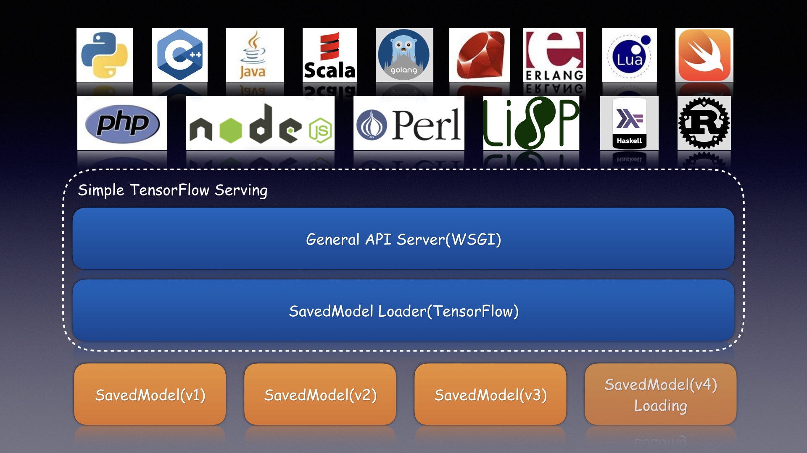
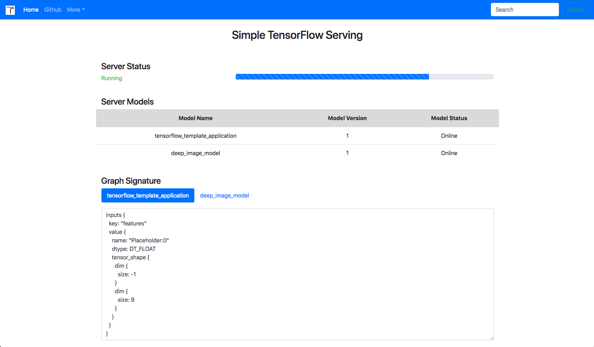
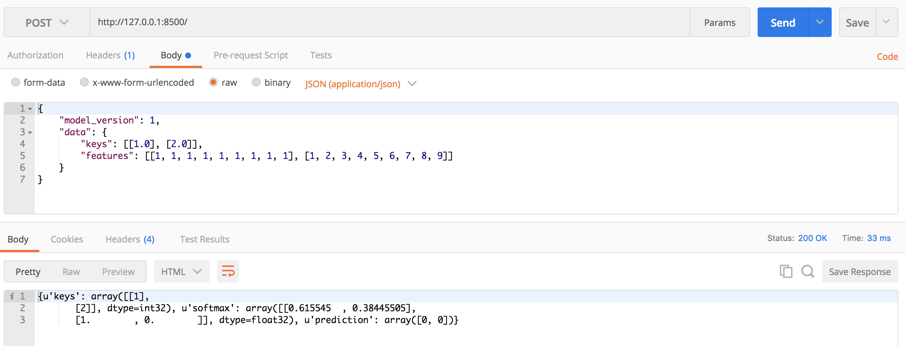
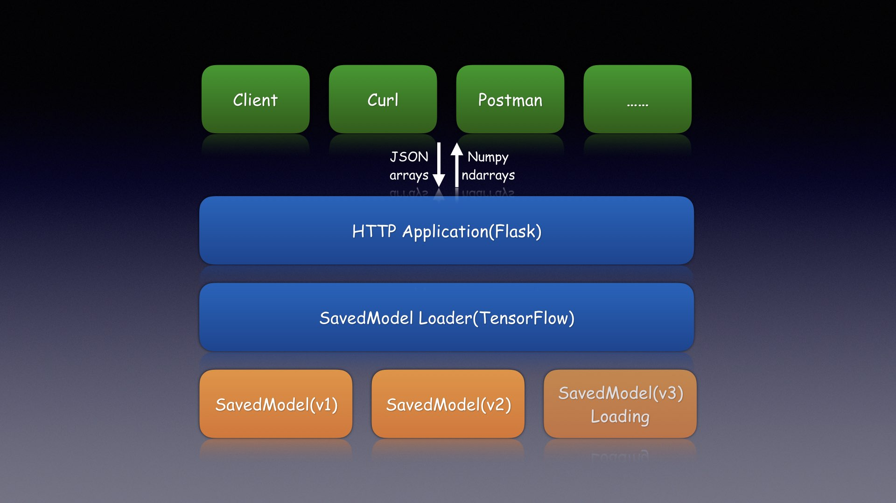

# Simple TensorFlow Serving



## Introduction

Simple TensorFlow Serving is the generic and easy-to-use serving service for machine learning models.

It is the bridge for TensorFlow models and bring machine learning to any programming language, such as [Bash](./bash_client/), [Python](./python_client/), [C++](./cpp_client/), [Java](./java_client/), [Scala](./scala_client/), [Go](./go_client/), [Ruby](./ruby_client), [JavaScript](./javascript_client/), [PHP](./php_client/), [Erlang](./erlang_client/), [Lua](./lua_client/), [Rust](./rust_client/), [Swift](./swift_client/), [Perl](./perl_client/), [Lisp](./lisp_client/), [Haskell](./haskell_client/), [Clojure](./clojure_client/), [R](./r_client/) and so on.

* [x] Support distributed TensorFlow models
* [x] Support the general RESTful/HTTP APIs
* [x] Support inference with accelerated GPU
* [x] Support `curl` and other command-line tools
* [x] Support clients in any programming language
* [x] Support code-gen SDKs by models without coding
* [x] Support inference for image models with raw file
* [x] Support statistical metrics for verbose requests
* [x] Support serving multiple models at the same time
* [x] Support dynamic online and offline for model versions
* [x] Support secure authentication with configurable basic auth

## Installation

Install the server with [pip](https://pypi.python.org/pypi/simple-tensorflow-serving).

```bash
pip install simple-tensorflow-serving
```

Or install with [bazel](https://bazel.build/).

```bash
bazel build simple_tensorflow_serving:server
```

Or install from [source code](https://github.com/tobegit3hub/simple_tensorflow_serving).

```bash
python ./setup.py install
```

Or use official [docker image](https://hub.docker.com/r/tobegit3hub/simple_tensorflow_serving/).

```bash
docker run -d -p 8501:8500 tobegit3hub/simple_tensorflow_serving
```

## Basic Usage

Start the server with the exported [SavedModel](https://www.tensorflow.org/programmers_guide/saved_model).

```bash
simple_tensorflow_serving --port=8500 --model_base_path="./models/tensorflow_template_application_model"
```

Check out the dashboard in [http://127.0.0.1:8500](http://127.0.0.1:8500) in your browser.
 


Then access the TensorFlow model and inference with test dataset.

```bash
curl -H "Content-Type: application/json" -X POST -d '{"data": {"keys": [[1.0], [2.0]], "features": [[10, 10, 10, 8, 6, 1, 8, 9, 1], [6, 2, 1, 1, 1, 1, 7, 1, 1]]}}' http://127.0.0.1:8500
```

## Advanced Usage

Here is the example client in [Bash](./bash_client/).

```bash
curl -H "Content-Type: application/json" -X POST -d '{"data": {"keys": [[1.0], [2.0]], "features": [[10, 10, 10, 8, 6, 1, 8, 9, 1], [6, 2, 1, 1, 1, 1, 7, 1, 1]]}}' http://127.0.0.1:8500
```

Here is the example client in [Python](./python_client/).

```python
endpoint = "http://127.0.0.1:8500"
payload = {"data": {"keys": [[11.0], [2.0]], "features": [[1, 1, 1, 1, 1, 1, 1, 1, 1], [1, 1, 1, 1, 1, 1, 1, 1, 1]]}}

result = requests.post(endpoint, json=payload)
```

Here is the example client in [C++](./cpp_client/).

Here is the example client in [Java](./java_client/).

Here is the example client in [Scala](./scala_client/).

Here is the example client in [Go](./go_client/).

```go
endpoint := "http://127.0.0.1:8500"
dataByte := []byte(`{"data": {"keys": [[11.0], [2.0]], "features": [[1, 1, 1, 1, 1, 1, 1, 1, 1], [1, 1, 1, 1, 1, 1, 1, 1, 1]]}}`)
var dataInterface map[string]interface{}
json.Unmarshal(dataByte, &dataInterface)
dataJson, _ := json.Marshal(dataInterface)

resp, err := http.Post(endpoint, "application/json", bytes.NewBuffer(dataJson))
```

Here is the example client in [Ruby](./ruby_client/).

```ruby
endpoint = "http://127.0.0.1:8500"
uri = URI.parse(endpoint)
header = {"Content-Type" => "application/json"}
input_data = {"data" => {"keys"=> [[11.0], [2.0]], "features"=> [[1, 1, 1, 1, 1, 1, 1, 1, 1], [1, 1, 1, 1, 1, 1, 1, 1, 1]]}}
http = Net::HTTP.new(uri.host, uri.port)
request = Net::HTTP::Post.new(uri.request_uri, header)
request.body = input_data.to_json

response = http.request(request)
```

Here is the example client in [JavaScript](./javascript_client/).

```javascript
var options = {
    uri: "http://127.0.0.1:8500",
    method: "POST",
    json: {"data": {"keys": [[11.0], [2.0]], "features": [[1, 1, 1, 1, 1, 1, 1, 1, 1], [1, 1, 1, 1, 1, 1, 1, 1, 1]]}}
};

request(options, function (error, response, body) {});
```

Here is the example client in [PHP](./php_client/).

```php
$endpoint = "127.0.0.1:8500";
$inputData = array(
    "keys" => [[11.0], [2.0]],
    "features" => [[1, 1, 1, 1, 1, 1, 1, 1, 1], [1, 1, 1, 1, 1, 1, 1, 1, 1]],
);
$jsonData = array(
    "data" => $inputData,
);
$ch = curl_init($endpoint);
curl_setopt_array($ch, array(
    CURLOPT_POST => TRUE,
    CURLOPT_RETURNTRANSFER => TRUE,
    CURLOPT_HTTPHEADER => array(
        "Content-Type: application/json"
    ),
    CURLOPT_POSTFIELDS => json_encode($jsonData)
));

$response = curl_exec($ch);
```

Here is the example client in [Erlang](./erlang_client/).

```erlang
ssl:start(),
application:start(inets),
httpc:request(post,
  {"http://127.0.0.1:8500", [],
  "application/json",
  "{\"data\": {\"keys\": [[11.0], [2.0]], \"features\": [[1, 1, 1, 1, 1, 1, 1, 1, 1], [1, 1, 1, 1, 1, 1, 1, 1, 1]]}}"
  }, [], []).
```

Here is the example client in [Lua](./lua_client/).

```lua
local endpoint = "http://127.0.0.1:8500"
keys_array = {}
keys_array[1] = {1.0}
keys_array[2] = {2.0}
features_array = {}
features_array[1] = {1, 1, 1, 1, 1, 1, 1, 1, 1}
features_array[2] = {1, 1, 1, 1, 1, 1, 1, 1, 1}
local input_data = {
    ["keys"] = keys_array,
    ["features"] = features_array,
}
local json_data = {
    ["data"] = input_data
}
request_body = json:encode (json_data)
local response_body = {}

local res, code, response_headers = http.request{
    url = endpoint,
    method = "POST", 
    headers = 
      {
          ["Content-Type"] = "application/json";
          ["Content-Length"] = #request_body;
      },
      source = ltn12.source.string(request_body),
      sink = ltn12.sink.table(response_body),
}
```

Here is the example client in [Rust](./swift_client/).

Here is the example client in [Swift](./swift_client/).

Here is the example client in [Perl](./perl_client/).

```perl
my $endpoint = "http://127.0.0.1:8500";
my $json = '{"data": {"keys": [[11.0], [2.0]], "features": [[1, 1, 1, 1, 1, 1, 1, 1, 1], [1, 1, 1, 1, 1, 1, 1, 1, 1]]}}';
my $req = HTTP::Request->new( 'POST', $endpoint );
$req->header( 'Content-Type' => 'application/json' );
$req->content( $json );
$ua = LWP::UserAgent->new;

$response = $ua->request($req);
```

Here is the example client in [Lisp](./swift_client/).

Here is the example client in [Haskell](./swift_client/).

Here is the example client in [Clojure](./clojure_client/).

Here is the example client in [R](./r_client/).

```r
endpoint <- "http://127.0.0.1:8500"
body <- list(data = list(a = 1), keys = 1)
json_data <- list(
  data = list(
    keys = list(list(1.0), list(2.0)), features = list(list(1, 1, 1, 1, 1, 1, 1, 1, 1), list(1, 1, 1, 1, 1, 1, 1, 1, 1))
  )
)

r <- POST(endpoint, body = json_data, encode = "json")
stop_for_status(r)
content(r, "parsed", "text/html")
```

Here is the example with Postman.



## Generated SDK

You can also generate SDK in different languages(Bash, Python, Golang, JavaScript etc.) for your model without writing any code.

```bash
simple_tensorflow_serving --model_base_path="./models/tensorflow_template_application_model/" --gen_sdk bash
```

```bash
simple_tensorflow_serving --model_base_path="./models/tensorflow_template_application_model/" --gen_sdk python
```

The generated code should look like these which can be test immediately.

```bash
#!/bin/bash

curl -H "Content-Type: application/json" -X POST -d '{"data": {"keys": [[1.0], [1.0]], "features": [[1.0, 1.0, 1.0, 1.0, 1.0, 1.0, 1.0, 1.0, 1.0], [1.0, 1.0, 1.0, 1.0, 1.0, 1.0, 1.0, 1.0, 1.0]]} }' http://127.0.0.1:8500
```

```python
#!/usr/bin/env python

import requests

def main():
  endpoint = "http://127.0.0.1:8500"

  input_data = {"keys": [[1.0], [1.0]], "features": [[1.0, 1.0, 1.0, 1.0, 1.0, 1.0, 1.0, 1.0, 1.0], [1.0, 1.0, 1.0, 1.0, 1.0, 1.0, 1.0, 1.0, 1.0]]}
  result = requests.post(endpoint, json=input_data)
  print(result.text)

if __name__ == "__main__":
  main()
```

## Image Models

For image models, we can request with the raw image files instead of constructing array data.
 
Now start serving the image model like [deep_image_model](https://github.com/tobegit3hub/deep_image_model).

```bash
simple_tensorflow_serving --model_base_path="../models/deep_image_model/"
```

Then request with the raw image file which has the same shape of your model.

```bash
curl -X POST -F 'image=@./images/mew.jpg' -F "model_version=1" 127.0.0.1:8500
```

## Authentication

For enterprises, we can enable basic auth for all the APIs and any anonymous request is denied.

Now start the server with the configured username and password.

```bash
./server.py --model_base_path="../models/tensorflow_template_application_model/" --enable_auth=True --auth_username="admin" --auth_password="admin"
```

If you are using the Web dashboard, just type your certification. If you are using clients, give the username and password within the request.

```
curl -u admin:admin -H "Content-Type: application/json" -X POST -d '{"data": {"keys": [[11.0], [2.0]], "features": [[1, 1, 1, 1, 1, 1, 1, 1, 1], [1, 1, 1, 1, 1, 1, 1, 1, 1]]}}' http://127.0.0.1:8500
```

```python
endpoint = "http://127.0.0.1:8500"
input_data = {
  "data": {
      "keys": [[11.0], [2.0]],
      "features": [[1, 1, 1, 1, 1, 1, 1, 1, 1], [1, 1, 1, 1, 1, 1, 1, 1, 1]]
  }
}
auth = requests.auth.HTTPBasicAuth("admin", "admin")
result = requests.post(endpoint, json=input_data, auth=auth)
```

## How It Works

1. `simple_tensorflow_serving` starts the HTTP server with `flask` application.
2. Load the TensorFlow models with `tf.saved_model.loader` Python API.
3. Construct the feed_dict data from the JSON body of the request.
   ```
   // Method: POST, Content-Type: application/json
   {
     "model_version": 1, // Optional
     "data": {
       "keys": [[1.0], [2.0]],
       "features": [[10, 10, 10, 8, 6, 1, 8, 9, 1], [6, 2, 1, 1, 1, 1, 7, 1, 1]]
     }
   }
   ```
4. Use the TensorFlow Python API to `sess.run()` with feed_dict data.
5. For multiple versions supported, it starts independent thread to load models.
6. For generated SDKs, it reads user's model and render code with [Jinja](http://jinja.pocoo.org/) templates. 



## Contribution

Check out the C++ implementation of TensorFlow Serving in [tensorflow/serving](https://github.com/tensorflow/serving).

Feel free to open an issue or send pull request for this project. It is warmly welcome to add more clients in your languages to access TensorFlow models.
