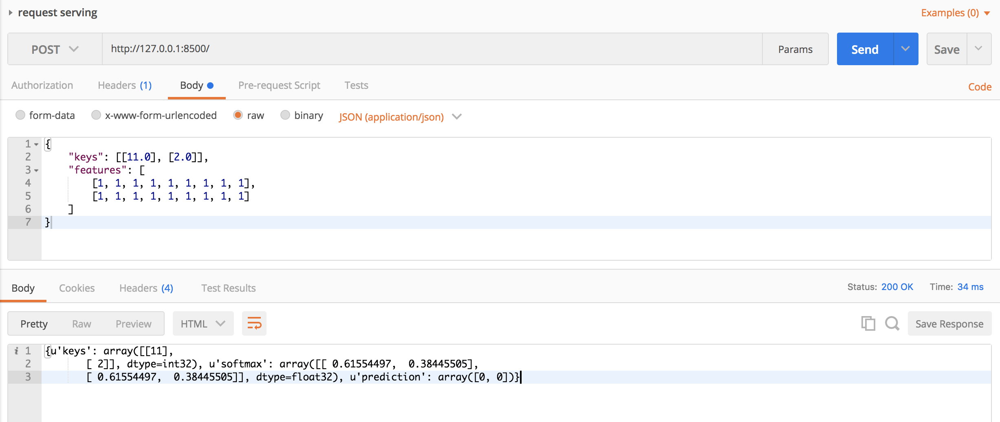

# Simple TensorFlow Serving

## Introduction

The simpler and easy-to-use serving service for general TensorFlow models.

* [x] Support TensorFlow SavedModel
* [x] Support the RESTful/HTTP APIs
* [x] Support `curl` and command-line tools
* [x] Support clients in any programing language
* [x] Support statistical metrics for verbose requests
* [ ] Support loading multiple TF models dynamically

## Installation

Install the server with `pip`.

```shell
pip install simple-tensorflow-serving
```

Or install with `bazel`.

```shell
bazel build simple_tensorflow_serving:server
```

Or install from source code.

```shell
python ./setup.py install
```

## Usage

You can export the [SavedModel](https://www.tensorflow.org/programmers_guide/saved_model) and setup the server easily.

```shell
simple_tensorflow_serving --port=8500 --model_base_path="./examples/tensorflow_template_application_model"
```

Then request with the command-line tool like `curl`.

```shell
curl -H "Content-Type: application/json" -X POST -d '{"keys": [[11.0], [2.0]], "features": [[1, 1, 1, 1, 1, 1, 1, 1, 1], [1, 1, 1, 1, 1, 1, 1, 1, 1]]}' http://127.0.0.1:8500
```

Or use your favorite HTTP clients, such as `Postman`.



Here is the example client in [Python](./python_client/).

```python
import requests

endpoint = "http://127.0.0.1:8500"
payload = {"keys": [[11.0], [2.0]], "features": [[1, 1, 1, 1, 1, 1, 1, 1, 1], [1, 1, 1, 1, 1, 1, 1, 1, 1]]}
result = requests.post(endpoint, json=payload)
print(result.text)
```

You can use the example client in [Java](./java_client/).

```java

```


## How It Works

1. `simple_tensorflow_serving` starts the HTTP server with `flask` application.
2. Load the TensorFlow models with `tf.saved_model.loader` Python APIs.
3. Construct the feed_dict data from the JSON body of the request
4. Use the TensorFlow Python API to `sess.run()` with feed_dict data
5. For multiple versions supported, it has independent thread to load models


## Contribution

Check out the C++ implementation of TensorFlow Serving in [tensorflow/serving](https://github.com/tensorflow/serving).

Feel free to open an issue or send pull request for this project.
