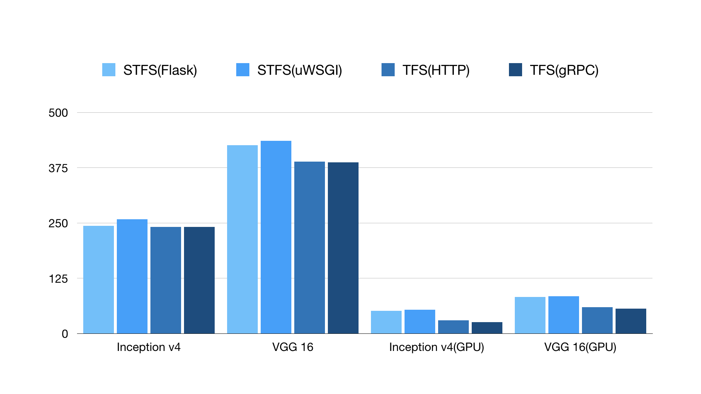
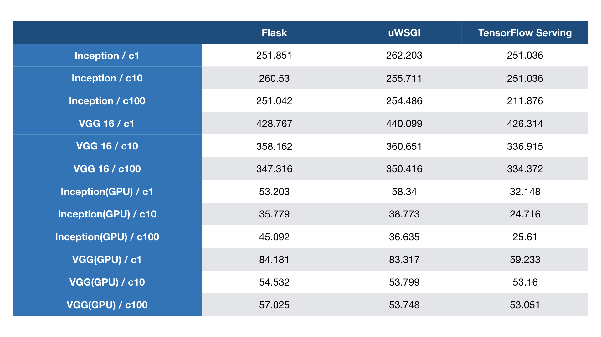
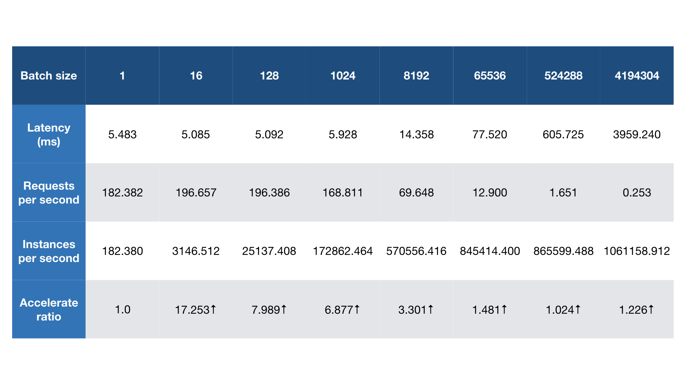

# Simple TensorFlow Serving


## Introduction

Simple TensorFlow Serving is the generic and easy-to-use serving service for machine learning models. Read more in <https://stfs.readthedocs.io>.

* [x] Support distributed TensorFlow models
* [x] Support the general RESTful/HTTP APIs
* [x] Support inference with accelerated GPU
* [x] Support `curl` and other command-line tools
* [x] Support clients in any programming language
* [x] Support code-gen client by models without coding
* [x] Support inference with raw file for image models
* [x] Support statistical metrics for verbose requests
* [x] Support serving multiple models at the same time
* [x] Support dynamic online and offline for model versions
* [x] Support loading new custom op for TensorFlow models
* [x] Support secure authentication with configurable basic auth
* [x] Support multiple models of TensorFlow/MXNet/PyTorch/Caffe2/CNTK/ONNX/H2o/Scikit-learn/XGBoost/PMML/Spark MLlib

## Installation

Install the server with [pip](https://pypi.python.org/pypi/simple-tensorflow-serving).

```bash
pip install simple_tensorflow_serving
```

Or install from [source code](https://github.com/tobegit3hub/simple_tensorflow_serving).

```bash
python ./setup.py install

python ./setup.py develop

bazel build simple_tensorflow_serving:server
```

Or use the [docker image](https://hub.docker.com/r/tobegit3hub/simple_tensorflow_serving/).

```bash
docker run -d -p 8500:8500 tobegit3hub/simple_tensorflow_serving

docker run -d -p 8500:8500 tobegit3hub/simple_tensorflow_serving:latest-gpu

docker run -d -p 8500:8500 tobegit3hub/simple_tensorflow_serving:latest-hdfs

docker run -d -p 8500:8500 tobegit3hub/simple_tensorflow_serving:latest-py34
```

````bash
docker-compose up -d
````

Or deploy in [Kubernetes](https://kubernetes.io/).

```bash
kubectl create -f ./simple_tensorflow_serving.yaml
```

## Quick Start

Start the server with the TensorFlow [SavedModel](https://www.tensorflow.org/programmers_guide/saved_model).

```bash
simple_tensorflow_serving --model_base_path="./models/tensorflow_template_application_model"
```

Check out the dashboard in [http://127.0.0.1:8500](http://127.0.0.1:8500) in web browser.
 


Generate Python client and access the model with test data without coding.

```bash
curl http://localhost:8500/v1/models/default/gen_client?language=python > client.py
```

```bash
python ./client.py
```

## Advanced Usage

### Multiple Models

It supports serve multiple models and multiple versions of these models. You can run the server with this configuration.

```json
{
  "model_config_list": [
    {
      "name": "tensorflow_template_application_model",
      "base_path": "./models/tensorflow_template_application_model/",
      "platform": "tensorflow"
    }, {
      "name": "deep_image_model",
      "base_path": "./models/deep_image_model/",
      "platform": "tensorflow"
    }, {
       "name": "mxnet_mlp_model",
       "base_path": "./models/mxnet_mlp/mx_mlp",
       "platform": "mxnet"
    }
  ]
}
```

```bash
simple_tensorflow_serving --model_config_file="./examples/model_config_file.json"
```

Adding or removing model versions will be detected automatically and re-load latest files in memory. You can easily choose the specified model and version for inference.

```json
endpoint = "http://127.0.0.1:8500"
input_data = {
  "model_name": "default",
  "model_version": 1,
  "data": {
      "keys": [[11.0], [2.0]],
      "features": [[1, 1, 1, 1, 1, 1, 1, 1, 1],
                   [1, 1, 1, 1, 1, 1, 1, 1, 1]]
  }
}
result = requests.post(endpoint, json=input_data)
```

### GPU Acceleration

If you want to use GPU, try with the docker image with GPU tag and put cuda files in `/usr/cuda_files/`.

```bash
export CUDA_SO="-v /usr/cuda_files/:/usr/cuda_files/"
export DEVICES=$(\ls /dev/nvidia* | xargs -I{} echo '--device {}:{}')
export LIBRARY_ENV="-e LD_LIBRARY_PATH=/usr/local/cuda/extras/CUPTI/lib64:/usr/local/nvidia/lib:/usr/local/nvidia/lib64:/usr/cuda_files"

docker run -it -p 8500:8500 $CUDA_SO $DEVICES $LIBRARY_ENV tobegit3hub/simple_tensorflow_serving:latest-gpu
```

You can set session config and gpu options in command-line parameter or the model config file.

```bash
simple_tensorflow_serving --model_base_path="./models/tensorflow_template_application_model" --session_config='{"log_device_placement": true, "allow_soft_placement": true, "allow_growth": true, "per_process_gpu_memory_fraction": 0.5}'
```

```json
{
  "model_config_list": [
    {
      "name": "default",
      "base_path": "./models/tensorflow_template_application_model/",
      "platform": "tensorflow",
      "session_config": {
        "log_device_placement": true,
        "allow_soft_placement": true,
        "allow_growth": true,
        "per_process_gpu_memory_fraction": 0.5
      }
    }
  ]
}
```

### Generated Client

You can generate the test json data for the online models.

```bash
curl http://localhost:8500/v1/models/default/gen_json
```

Or generate clients in different languages(Bash, Python, Golang, JavaScript etc.) for your model without writing any code.

```bash
curl http://localhost:8500/v1/models/default/gen_client?language=python > client.py
curl http://localhost:8500/v1/models/default/gen_client?language=bash > client.sh
curl http://localhost:8500/v1/models/default/gen_client?language=golang > client.go
curl http://localhost:8500/v1/models/default/gen_client?language=javascript > client.js
```

The generated code should look like these which can be test immediately.

```python
#!/usr/bin/env python

import requests

def main():
  endpoint = "http://127.0.0.1:8500"
  json_data = {"model_name": "default", "data": {"keys": [[1], [1]], "features": [[1.0, 1.0, 1.0, 1.0, 1.0, 1.0, 1.0, 1.0, 1.0], [1.0, 1.0, 1.0, 1.0, 1.0, 1.0, 1.0, 1.0, 1.0]]} }
  result = requests.post(endpoint, json=json_data)
  print(result.text)

if __name__ == "__main__":
  main()
```

```python
#!/usr/bin/env python

import requests

def main():
  endpoint = "http://127.0.0.1:8500"

  input_data = {"keys": [[1.0], [1.0]], "features": [[1.0, 1.0, 1.0, 1.0, 1.0, 1.0, 1.0, 1.0, 1.0], [1.0, 1.0, 1.0, 1.0, 1.0, 1.0, 1.0, 1.0, 1.0]]}
  result = requests.post(endpoint, json=input_data)
  print(result.text)

if __name__ == "__main__":
  main()
```

### Image Model

For image models, we can request with the raw image files instead of constructing array data.

Now start serving the image model like [deep_image_model](https://github.com/tobegit3hub/deep_image_model).

```bash
simple_tensorflow_serving --model_base_path="./models/deep_image_model/"
```

Then request with the raw image file which has the same shape of your model.

```bash
curl -X POST -F 'image=@./images/mew.jpg' -F "model_version=1" 127.0.0.1:8500
```

### Custom Op

If your models rely on new TensorFlow [custom op](https://www.tensorflow.org/extend/adding_an_op), you can run the server while loading the so files.

```bash
simple_tensorflow_serving --model_base_path="./model/" --custom_op_paths="./foo_op/"
```

Please check out the complete example in [./examples/custom_op/](./examples/custom_op/).

### Authentication

For enterprises, we can enable basic auth for all the APIs and any anonymous request is denied.

Now start the server with the configured username and password.

```bash
./server.py --model_base_path="./models/tensorflow_template_application_model/" --enable_auth=True --auth_username="admin" --auth_password="admin"
```

If you are using the Web dashboard, just type your certification. If you are using clients, give the username and password within the request.

```bash
curl -u admin:admin -H "Content-Type: application/json" -X POST -d '{"data": {"keys": [[11.0], [2.0]], "features": [[1, 1, 1, 1, 1, 1, 1, 1, 1], [1, 1, 1, 1, 1, 1, 1, 1, 1]]}}' http://127.0.0.1:8500
```

```python
endpoint = "http://127.0.0.1:8500"
input_data = {
  "data": {
      "keys": [[11.0], [2.0]],
      "features": [[1, 1, 1, 1, 1, 1, 1, 1, 1], [1, 1, 1, 1, 1, 1, 1, 1, 1]]
  }
}
auth = requests.auth.HTTPBasicAuth("admin", "admin")
result = requests.post(endpoint, json=input_data, auth=auth)
```

### TSL/SSL

It supports TSL/SSL and you can generate the self-signed secret files for testing.

```bash
openssl req -x509 -newkey rsa:4096 -nodes -out /tmp/secret.pem -keyout /tmp/secret.key -days 365
```

Then run the server with certification files.

```bash
simple_tensorflow_serving --enable_ssl=True --secret_pem=/tmp/secret.pem --secret_key=/tmp/secret.key --model_base_path="./models/tensorflow_template_application_model"
```

## Supported Models

For MXNet models, you can load with commands and configuration like these.

```bash
simple_tensorflow_serving --model_base_path="./models/mxnet_mlp/mx_mlp" --model_platform="mxnet"
```

```python
endpoint = "http://127.0.0.1:8500"
input_data = {
  "model_name": "default",
  "model_version": 1,
  "data": {
      "data": [[12.0, 2.0]]
  }
}
result = requests.post(endpoint, json=input_data)
print(result.text)
```

For ONNX models, you can load with commands and configuration like these.

```bash
simple_tensorflow_serving --model_base_path="./models/onnx_mnist_model/onnx_model.proto" --model_platform="onnx"
```

```python
endpoint = "http://127.0.0.1:8500"
input_data = {
  "model_name": "default",
  "model_version": 1,
  "data": {
      "data": [[...]]
  }
}
result = requests.post(endpoint, json=input_data)
print(result.text)
```

For H2o models, you can load with commands and configuration like these.

```bash
# Start H2o server with "java -jar h2o.jar"

simple_tensorflow_serving --model_base_path="./models/h2o_prostate_model/GLM_model_python_1525255083960_17" --model_platform="h2o"
```

```python
endpoint = "http://127.0.0.1:8500"
input_data = {
  "model_name": "default",
  "model_version": 1,
  "data": {
      "data": [[...]]
  }
}
result = requests.post(endpoint, json=input_data)
print(result.text)
```

For Scikit-learn models, you can load with commands and configuration like these.

```bash
simple_tensorflow_serving --model_base_path="./models/scikitlearn_iris/model.joblib" --model_platform="scikitlearn"

simple_tensorflow_serving --model_base_path="./models/scikitlearn_iris/model.pkl" --model_platform="scikitlearn"
```

```python
endpoint = "http://127.0.0.1:8500"
input_data = {
  "model_name": "default",
  "model_version": 1,
  "data": {
      "data": [[...]]
  }
}
result = requests.post(endpoint, json=input_data)
print(result.text)
```

For XGBoost models, you can load with commands and configuration like these.

```bash
simple_tensorflow_serving --model_base_path="./models/xgboost_iris/model.bst" --model_platform="xgboost"

simple_tensorflow_serving --model_base_path="./models/xgboost_iris/model.joblib" --model_platform="xgboost"

simple_tensorflow_serving --model_base_path="./models/xgboost_iris/model.pkl" --model_platform="xgboost"
```

```python
endpoint = "http://127.0.0.1:8500"
input_data = {
  "model_name": "default",
  "model_version": 1,
  "data": {
      "data": [[...]]
  }
}
result = requests.post(endpoint, json=input_data)
print(result.text)
```

For PMML models, you can load with commands and configuration like these. This relies on [Openscoring](https://github.com/openscoring/openscoring) and [Openscoring-Python](https://github.com/openscoring/openscoring-python) to load the models.

```bash
java -jar ./third_party/openscoring/openscoring-server-executable-1.4-SNAPSHOT.jar

simple_tensorflow_serving --model_base_path="./models/pmml_iris/DecisionTreeIris.pmml" --model_platform="pmml"
```

```python
endpoint = "http://127.0.0.1:8500"
input_data = {
  "model_name": "default",
  "model_version": 1,
  "data": {
      "data": [[...]]
  }
}
result = requests.post(endpoint, json=input_data)
print(result.text)
```


## Supported Client

Here is the example client in [Bash](./bash_client/).

```bash
curl -H "Content-Type: application/json" -X POST -d '{"data": {"keys": [[1.0], [2.0]], "features": [[10, 10, 10, 8, 6, 1, 8, 9, 1], [6, 2, 1, 1, 1, 1, 7, 1, 1]]}}' http://127.0.0.1:8500
```

Here is the example client in [Python](./python_client/).

```python
endpoint = "http://127.0.0.1:8500"
payload = {"data": {"keys": [[11.0], [2.0]], "features": [[1, 1, 1, 1, 1, 1, 1, 1, 1], [1, 1, 1, 1, 1, 1, 1, 1, 1]]}}

result = requests.post(endpoint, json=payload)
```

Here is the example client in [C++](./cpp_client/).

Here is the example client in [Java](./java_client/).

Here is the example client in [Scala](./scala_client/).

Here is the example client in [Go](./go_client/).

```go
endpoint := "http://127.0.0.1:8500"
dataByte := []byte(`{"data": {"keys": [[11.0], [2.0]], "features": [[1, 1, 1, 1, 1, 1, 1, 1, 1], [1, 1, 1, 1, 1, 1, 1, 1, 1]]}}`)
var dataInterface map[string]interface{}
json.Unmarshal(dataByte, &dataInterface)
dataJson, _ := json.Marshal(dataInterface)

resp, err := http.Post(endpoint, "application/json", bytes.NewBuffer(dataJson))
```

Here is the example client in [Ruby](./ruby_client/).

```ruby
endpoint = "http://127.0.0.1:8500"
uri = URI.parse(endpoint)
header = {"Content-Type" => "application/json"}
input_data = {"data" => {"keys"=> [[11.0], [2.0]], "features"=> [[1, 1, 1, 1, 1, 1, 1, 1, 1], [1, 1, 1, 1, 1, 1, 1, 1, 1]]}}
http = Net::HTTP.new(uri.host, uri.port)
request = Net::HTTP::Post.new(uri.request_uri, header)
request.body = input_data.to_json

response = http.request(request)
```

Here is the example client in [JavaScript](./javascript_client/).

```javascript
var options = {
    uri: "http://127.0.0.1:8500",
    method: "POST",
    json: {"data": {"keys": [[11.0], [2.0]], "features": [[1, 1, 1, 1, 1, 1, 1, 1, 1], [1, 1, 1, 1, 1, 1, 1, 1, 1]]}}
};

request(options, function (error, response, body) {});
```

Here is the example client in [PHP](./php_client/).

```php
$endpoint = "127.0.0.1:8500";
$inputData = array(
    "keys" => [[11.0], [2.0]],
    "features" => [[1, 1, 1, 1, 1, 1, 1, 1, 1], [1, 1, 1, 1, 1, 1, 1, 1, 1]],
);
$jsonData = array(
    "data" => $inputData,
);
$ch = curl_init($endpoint);
curl_setopt_array($ch, array(
    CURLOPT_POST => TRUE,
    CURLOPT_RETURNTRANSFER => TRUE,
    CURLOPT_HTTPHEADER => array(
        "Content-Type: application/json"
    ),
    CURLOPT_POSTFIELDS => json_encode($jsonData)
));

$response = curl_exec($ch);
```

Here is the example client in [Erlang](./erlang_client/).

```erlang
ssl:start(),
application:start(inets),
httpc:request(post,
  {"http://127.0.0.1:8500", [],
  "application/json",
  "{\"data\": {\"keys\": [[11.0], [2.0]], \"features\": [[1, 1, 1, 1, 1, 1, 1, 1, 1], [1, 1, 1, 1, 1, 1, 1, 1, 1]]}}"
  }, [], []).
```

Here is the example client in [Lua](./lua_client/).

```lua
local endpoint = "http://127.0.0.1:8500"
keys_array = {}
keys_array[1] = {1.0}
keys_array[2] = {2.0}
features_array = {}
features_array[1] = {1, 1, 1, 1, 1, 1, 1, 1, 1}
features_array[2] = {1, 1, 1, 1, 1, 1, 1, 1, 1}
local input_data = {
    ["keys"] = keys_array,
    ["features"] = features_array,
}
local json_data = {
    ["data"] = input_data
}
request_body = json:encode (json_data)
local response_body = {}

local res, code, response_headers = http.request{
    url = endpoint,
    method = "POST", 
    headers = 
      {
          ["Content-Type"] = "application/json";
          ["Content-Length"] = #request_body;
      },
      source = ltn12.source.string(request_body),
      sink = ltn12.sink.table(response_body),
}
```

Here is the example client in [Rust](./swift_client/).

Here is the example client in [Swift](./swift_client/).

Here is the example client in [Perl](./perl_client/).

```perl
my $endpoint = "http://127.0.0.1:8500";
my $json = '{"data": {"keys": [[11.0], [2.0]], "features": [[1, 1, 1, 1, 1, 1, 1, 1, 1], [1, 1, 1, 1, 1, 1, 1, 1, 1]]}}';
my $req = HTTP::Request->new( 'POST', $endpoint );
$req->header( 'Content-Type' => 'application/json' );
$req->content( $json );
$ua = LWP::UserAgent->new;

$response = $ua->request($req);
```

Here is the example client in [Lisp](./swift_client/).

Here is the example client in [Haskell](./swift_client/).

Here is the example client in [Clojure](./clojure_client/).

Here is the example client in [R](./r_client/).

```r
endpoint <- "http://127.0.0.1:8500"
body <- list(data = list(a = 1), keys = 1)
json_data <- list(
  data = list(
    keys = list(list(1.0), list(2.0)), features = list(list(1, 1, 1, 1, 1, 1, 1, 1, 1), list(1, 1, 1, 1, 1, 1, 1, 1, 1))
  )
)

r <- POST(endpoint, body = json_data, encode = "json")
stop_for_status(r)
content(r, "parsed", "text/html")
```

Here is the example with Postman.


## Performance

You can run SimpleTensorFlowServing with any WSGI server for better performance. We have benchmarked and compare with `TensorFlow Serving`. Find more details in [benchmark](./benchmark/).

STFS(Simple TensorFlow Serving) and TFS(TensorFlow Serving) have similar performances for different models. Vertical coordinate is inference latency(microsecond) and the less is better.



Then we test with `ab` with concurrent clients in CPU and GPU. `TensorFlow Serving` works better especially with GPUs.



For [simplest model](./benchmark/simplest_model/), each request only costs ~1.9 microseconds and one instance of Simple TensorFlow Serving can achieve 5000+ QPS. With larger batch size, it can inference more than 1M instances per second.



## How It Works

1. `simple_tensorflow_serving` starts the HTTP server with `flask` application.
2. Load the TensorFlow models with `tf.saved_model.loader` Python API.
3. Construct the feed_dict data from the JSON body of the request.
   ```
   // Method: POST, Content-Type: application/json
   {
     "model_version": 1, // Optional
     "data": {
       "keys": [[1], [2]],
       "features": [[1.0, 1.0, 1.0, 1.0, 1.0, 1.0, 1.0, 1.0, 1.0], [1.0, 2.0, 3.0, 4.0, 5.0, 6.0, 7.0, 8.0, 9.0]]
     }
   }
   ```
4. Use the TensorFlow Python API to `sess.run()` with feed_dict data.
5. For multiple versions supported, it starts independent thread to load models.
6. For generated clients, it reads user's model and render code with [Jinja](http://jinja.pocoo.org/) templates. 


## Contribution

Feel free to open an issue or send pull request for this project. It is warmly welcome to add more clients in your languages to access TensorFlow models.
