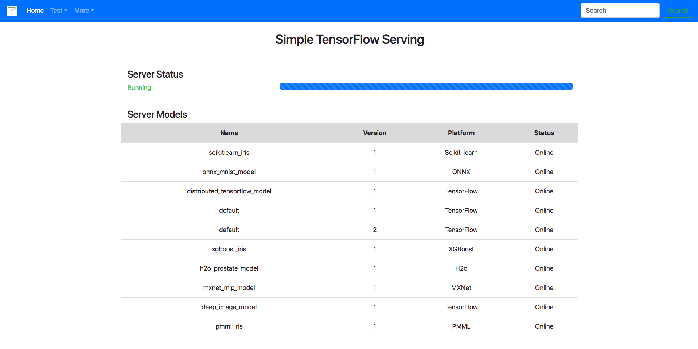
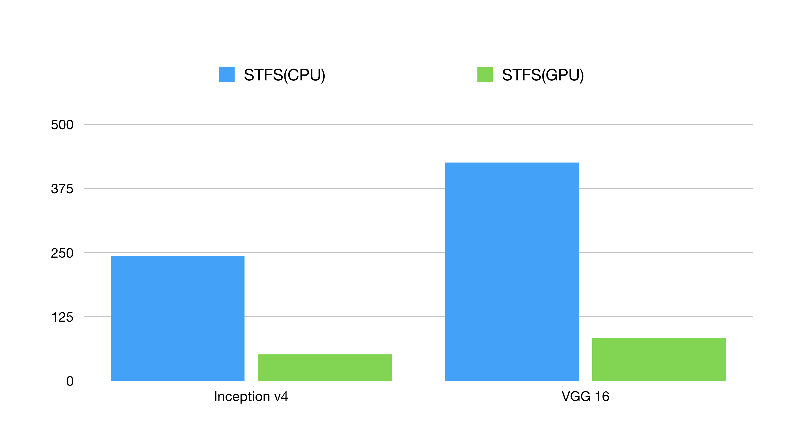

# Advanced Usage

## Multiple Models

It supports serve multiple models and multiple versions of these models. You can run the server with this configuration.

```json
{
  "model_config_list": [
    {
      "name": "tensorflow_template_application_model",
      "base_path": "./models/tensorflow_template_application_model/",
      "platform": "tensorflow"
    }, {
      "name": "deep_image_model",
      "base_path": "./models/deep_image_model/",
      "platform": "tensorflow"
    }, {
       "name": "mxnet_mlp_model",
       "base_path": "./models/mxnet_mlp/mx_mlp",
       "platform": "mxnet"
    }
  ]
}
```

```bash
simple_tensorflow_serving --model_config_file="./examples/model_config_file.json"
```




## GPU Acceleration

If you want to use GPU, try with the docker image with GPU tag and put cuda files in `/usr/cuda_files/`.

```bash
export CUDA_SO="-v /usr/cuda_files/:/usr/cuda_files/"
export DEVICES=$(\ls /dev/nvidia* | xargs -I{} echo '--device {}:{}')
export LIBRARY_ENV="-e LD_LIBRARY_PATH=/usr/local/cuda/extras/CUPTI/lib64:/usr/local/nvidia/lib:/usr/local/nvidia/lib64:/usr/cuda_files"

docker run -it -p 8500:8500 $CUDA_SO $DEVICES $LIBRARY_ENV tobegit3hub/simple_tensorflow_serving:latest-gpu
```

You can set session config and gpu options in command-line parameter or the model config file.

```bash
simple_tensorflow_serving --model_base_path="./models/tensorflow_template_application_model" --session_config='{"log_device_placement": true, "allow_soft_placement": true, "allow_growth": true, "per_process_gpu_memory_fraction": 0.5}'
```

```json
{
  "model_config_list": [
    {
      "name": "default",
      "base_path": "./models/tensorflow_template_application_model/",
      "platform": "tensorflow",
      "session_config": {
        "log_device_placement": true,
        "allow_soft_placement": true,
        "allow_growth": true,
        "per_process_gpu_memory_fraction": 0.5
      }
    }
  ]
}
```

Here is the benchmark of CPU and GPU inference and y-coordinate is the latency(the lower the better).
 



## Generated Client

You can generate the test json data for the online models.

```bash
curl http://localhost:8500/v1/models/default/gen_json
```

Or generate clients in different languages(Bash, Python, Golang, JavaScript etc.) for your model without writing any code.

```bash
curl http://localhost:8500/v1/models/default/gen_client?language=python > client.py
curl http://localhost:8500/v1/models/default/gen_client?language=bash > client.sh
curl http://localhost:8500/v1/models/default/gen_client?language=golang > client.go
curl http://localhost:8500/v1/models/default/gen_client?language=javascript > client.js
```

The generated code should look like these which can be test immediately.

```python
#!/usr/bin/env python

import requests

def main():
  endpoint = "http://127.0.0.1:8500"

  input_data = {"keys": [[1.0], [1.0]], "features": [[1.0, 1.0, 1.0, 1.0, 1.0, 1.0, 1.0, 1.0, 1.0], [1.0, 1.0, 1.0, 1.0, 1.0, 1.0, 1.0, 1.0, 1.0]]}
  result = requests.post(endpoint, json=input_data)
  print(result.json())

if __name__ == "__main__":
  main()
```

## Image Model

For image models, we can request with the raw image files instead of constructing array data.

Now start serving the image model like [deep_image_model](https://github.com/tobegit3hub/deep_image_model).

```bash
simple_tensorflow_serving --model_base_path="./models/deep_image_model/"
```

Then request with the raw image file which has the same shape of your model.

```bash
curl -X POST -F 'image=@./images/mew.jpg' -F "model_version=1" 127.0.0.1:8500
```

## Custom Op

If your models rely on new TensorFlow [custom op](https://www.tensorflow.org/extend/adding_an_op), you can run the server while loading the so files.

```bash
simple_tensorflow_serving --model_base_path="./model/" --custom_op_paths="./foo_op/"
```

Please check out the complete example in [./examples/custom_op/](./examples/custom_op/).

## Authentication

For enterprises, we can enable basic auth for all the APIs and any anonymous request is denied.

Now start the server with the configured username and password.

```bash
./server.py --model_base_path="./models/tensorflow_template_application_model/" --enable_auth=True --auth_username="admin" --auth_password="admin"
```

If you are using the Web dashboard, just type your certification. If you are using clients, give the username and password within the request.

```bash
curl -u admin:admin -H "Content-Type: application/json" -X POST -d '{"data": {"keys": [[11.0], [2.0]], "features": [[1, 1, 1, 1, 1, 1, 1, 1, 1], [1, 1, 1, 1, 1, 1, 1, 1, 1]]}}' http://127.0.0.1:8500
```

```python
endpoint = "http://127.0.0.1:8500"
input_data = {
  "data": {
      "keys": [[11.0], [2.0]],
      "features": [[1, 1, 1, 1, 1, 1, 1, 1, 1], [1, 1, 1, 1, 1, 1, 1, 1, 1]]
  }
}
auth = requests.auth.HTTPBasicAuth("admin", "admin")
result = requests.post(endpoint, json=input_data, auth=auth)
```

## TSL/SSL

It supports TSL/SSL and you can generate the self-signed secret files for testing.

```bash
openssl req -x509 -newkey rsa:4096 -nodes -out /tmp/secret.pem -keyout /tmp/secret.key -days 365
```

Then run the server with certification files.

```bash
simple_tensorflow_serving --enable_ssl=True --secret_pem=/tmp/secret.pem --secret_key=/tmp/secret.key --model_base_path="./models/tensorflow_template_application_model"
```
