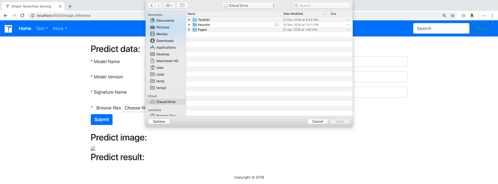

# Image Model

## Introduction

Simple TensorFlow Serving has extra support for image models. You can deploy the image models easily and make inferences by uploading the image files in web browser or using form-data. The best practice is accepting base64 strings as input of model signature like this.

```
inputs {
  key: "images"
  value {
    name: "model_input_b64_images:0"
    dtype: DT_STRING
    tensor_shape {
      dim {
        size: -1
      }
    }
  }
}
```

## Export Image Model

Model images should be standard TensorFlow SavedModel as well. We do not use `[batch_size, r, g, b]` or `[batch_size, r, b, g]` as signature input because it is not compatible with arbitrary image files. We can accept the base64 strings as input, then decode and resize the tensor for the required model input.

```
# Define model
def inference(input):
  weights = tf.get_variable(
      "weights", [784, 10], initializer=tf.random_normal_initializer())
  bias = tf.get_variable(
      "bias", [10], initializer=tf.random_normal_initializer())
  logits = tf.matmul(input, weights) + bias
 
  return logits
 
 
# Define op for model signature
tf.get_variable_scope().reuse_variables()
 
model_base64_placeholder = tf.placeholder(
    shape=[None], dtype=tf.string, name="model_input_b64_images")
model_base64_string = tf.decode_base64(model_base64_placeholder)
model_base64_input = tf.map_fn(lambda x: tf.image.resize_images(tf.image.decode_jpeg(x, channels=1), [28, 28]), model_base64_string, dtype=tf.float32)
model_base64_reshape_input = tf.reshape(model_base64_input, [-1, 28 * 28])
model_logits = inference(model_base64_reshape_input)
model_predict_softmax = tf.nn.softmax(model_logits)
model_predict = tf.argmax(model_predict_softmax, 1)
 
 
# Export model
export_dir = "./model/1"
tf.saved_model.simple_save(
    sess,
    export_dir,
    inputs={"images": model_base64_placeholder},
    outputs={
        "predict": model_predict,
        "probability": model_predict_softmax
    })
```

## Inference With Uploaded Files

Now we can start Simple TensorFlow Serving and load the image models easily. Take the deep_image_model for example.

```
git clone https://github.com/tobegit3hub/simple_tensorflow_serving

cd ./simple_tensorflow_serving/models/

simple_tensorflow_serving --model_base_path="./deep_image_model"
```

Then you can choose the local image file to make inference.




## Inference with Python Client

If you want to make inferences with Python client. You can encode the image file with the base64 library.

```
import requests
import base64

def main():
  image_string = base64.urlsafe_b64encode(open("./test.png", "rb").read())

  endpoint = "http://127.0.0.1:8500"
  json_data = {"model_name": "default", "data": {"images": [image_string]} }
  result = requests.post(endpoint, json=json_data)
  print(result.json())

if __name__ == "__main__":
  main()
```

Here is the exmaple data of one image's base64 string.

```
{"images": ["_9j_4AAQSkZJRgABAQAASABIAAD_4QCMRXhpZgAATU0AKgAAAAgABQESAAMAAAABAAEAAAEaAAUAAAABAAAASgEbAAUAAAABAAAAUgEoAAMAAAABAAIAAIdpAAQAAAABAAAAWgAAAAAAAABIAAAAAQAAAEgAAAABAAOgAQADAAAAAQABAACgAgAEAAAAAQAAACCgAwAEAAAAAQAAACAAAAAA_-EJIWh0dHA6Ly9ucy5hZG9iZS5jb20veGFwLzEuMC8APD94cGFja2V0IGJlZ2luPSLvu78iIGlkPSJXNU0wTXBDZWhpSHpyZVN6TlRjemtjOWQiPz4gPHg6eG1wbWV0YSB4bWxuczp4PSJhZG9iZTpuczptZXRhLyIgeDp4bXB0az0iWE1QIENvcmUgNS40LjAiPiA8cmRmOlJERiB4bWxuczpyZGY9Imh0dHA6Ly93d3cudzMub3JnLzE5OTkvMDIvMjItcmRmLXN5bnRheC1ucyMiPiA8cmRmOkRlc2NyaXB0aW9uIHJkZjphYm91dD0iIi8-IDwvcmRmOlJERj4gPC94OnhtcG1ldGE-ICAgICAgICAgICAgICAgICAgICAgICAgICAgICAgICAgICAgICAgICAgICAgICAgICAgICAgICAgICAgICAgICAgICAgICAgICAgICAgICAgICAgICAgICAgICAgICAgICAgICAgICAgICAgICAgICAgICAgICAgICAgICAgICAgICAgICAgICAgICAgICAgICAgICAgICAgICAgICAgICAgICAgICAgICAgICAgICAgICAgICAgICAgICAgICAgICAgICAgICAgICAgICAgICAgICAgICAgICAgICAgICAgICAgICAgICAgICAgICAgICAgICAgICAgICAgICAgICAgICAgICAgICAgICAgICAgICAgICAgICAgICAgICAgICAgICAgICAgICAgICAgICAgICAgICAgICAgICAgICAgICAgICAgICAgICAgICAgICAgICAgICAgICAgICAgICAgICAgICAgICAgICAgICAgICAgICAgICAgICAgICAgICAgICAgICAgICAgICAgICAgICAgICAgICAgICAgICAgICAgICAgICAgICAgICAgICAgICAgICAgICAgICAgICAgICAgICAgICAgICAgICAgICAgICAgICAgICAgICAgICAgICAgICAgICAgICAgICAgICAgICAgICAgICAgICAgICAgICAgICAgICAgICAgICAgICAgICAgICAgICAgICAgICAgICAgICAgICAgICAgICAgICAgICAgICAgICAgICAgICAgICAgICAgICAgICAgICAgICAgICAgICAgICAgICAgICAgICAgICAgICAgICAgICAgICAgICAgICAgICAgICAgICAgICAgICAgICAgICAgICAgICAgICAgICAgICAgICAgICAgICAgICAgICAgICAgICAgICAgICAgICAgICAgICAgICAgICAgICAgICAgICAgICAgICAgICAgICAgICAgICAgICAgICAgICAgICAgICAgICAgICAgICAgICAgICAgICAgICAgICAgICAgICAgICAgICAgICAgICAgICAgICAgICAgICAgICAgICAgICAgICAgICAgICAgICAgICAgICAgICAgICAgICAgICAgICAgICAgICAgICAgICAgICAgICAgICAgICAgICAgICAgICAgICAgICAgICAgICAgICAgICAgICAgICAgICAgICAgICAgICAgICAgICAgICAgICAgICAgICAgICAgICAgICAgICAgICAgICAgICAgICAgICAgICAgICAgICAgICAgICAgICAgICAgICAgICAgICAgICAgICAgICAgICAgICAgICAgICAgICAgICAgICAgICAgICAgICAgICAgICAgICAgICAgICAgICAgICAgICAgICAgICAgICAgICAgICAgICAgICAgICAgICAgICAgICAgICAgICAgICAgICAgICAgICAgICAgICAgICAgICAgICAgICAgICAgICAgICAgICAgICAgICAgICAgICAgICAgICAgICAgICAgICAgICAgICAgICAgICAgICAgICAgICAgICAgICAgICAgICAgICAgICAgICAgICAgICAgICAgICAgICAgICAgICAgICAgICAgICAgICAgICAgICAgICAgICAgICAgICAgICAgICAgICAgICAgICAgICAgICAgICAgICAgICAgICAgICAgICAgICAgICAgICAgICAgICAgICAgICAgICAgICAgICAgICAgICAgICAgICAgICAgICAgICAgICAgICAgICAgICAgICAgICAgICAgICAgICAgICAgICAgICAgICAgICAgICAgICAgICAgICAgICAgICAgICAgICAgICAgICAgICAgICAgICAgICAgICAgICAgICAgICAgICAgICAgICAgICAgICAgICAgICAgICAgICAgICAgICAgICAgICAgICAgICAgICAgICAgICAgICAgICAgICAgICAgICAgICAgICAgICAgICAgICAgICAgICAgICAgICAgICAgICAgICAgICAgICAgICAgICAgICAgICAgICAgICAgICAgICAgICAgICAgICAgICAgICAgICAgICAgICAgICAgICAgICAgICAgICAgICAgICAgICAgICAgICAgICAgICAgICAgICAgICAgICAgICAgICAgICAgICAgICAgICAgICAgICAgICAgICAgICAgICAgICAgICAgICAgICAgICAgICAgICAgICAgICAgICAgICAgICAgICAgICAgICAgICAgICAgICAgICAgICAgICAgICAgICAgICAgICAgICAgICAgICAgICAgICAgICAgICAgICAgICAgICAgICAgICAgICAgICAgICAgICAgICAgICAgICAgICAgICAgICAgICAgICAgICAgICAgICAgICAgICAgICAgICAgICAgICAgICAgICAgICAgICAgICAgICAgICAgICAgICAgICAgICAgICAgICAgICAgICAgICAgICAgICAgICAgICAgICAgICAgICAgICAgICAgICAgICAgICAgICAgICAgICAgICAgICAgICAgICAgICAgICAgICAgICAgICAgICAgICAgICAgICAgICAgICAgICAgICAgICAgICAgICAgICAgICAgICAgICAgICAgICAgICAgICAgICAgICAgPD94cGFja2V0IGVuZD0idyI_PgD_7QA4UGhvdG9zaG9wIDMuMAA4QklNBAQAAAAAAAA4QklNBCUAAAAAABDUHYzZjwCyBOmACZjs-EJ-_8AAEQgAIAAgAwEiAAIRAQMRAf_EAB8AAAEFAQEBAQEBAAAAAAAAAAABAgMEBQYHCAkKC__EALUQAAIBAwMCBAMFBQQEAAABfQECAwAEEQUSITFBBhNRYQcicRQygZGhCCNCscEVUtHwJDNicoIJChYXGBkaJSYnKCkqNDU2Nzg5OkNERUZHSElKU1RVVldYWVpjZGVmZ2hpanN0dXZ3eHl6g4SFhoeIiYqSk5SVlpeYmZqio6Slpqeoqaqys7S1tre4ubrCw8TFxsfIycrS09TV1tfY2drh4uPk5ebn6Onq8fLz9PX29_j5-v_EAB8BAAMBAQEBAQEBAQEAAAAAAAABAgMEBQYHCAkKC__EALURAAIBAgQEAwQHBQQEAAECdwABAgMRBAUhMQYSQVEHYXETIjKBCBRCkaGxwQkjM1LwFWJy0QoWJDThJfEXGBkaJicoKSo1Njc4OTpDREVGR0hJSlNUVVZXWFlaY2RlZmdoaWpzdHV2d3h5eoKDhIWGh4iJipKTlJWWl5iZmqKjpKWmp6ipqrKztLW2t7i5usLDxMXGx8jJytLT1NXW19jZ2uLj5OXm5-jp6vLz9PX29_j5-v_bAEMAAgICAgICAwICAwUDAwMFBgUFBQUGCAYGBgYGCAoICAgICAgKCgoKCgoKCgwMDAwMDA4ODg4ODw8PDw8PDw8PD__bAEMBAgICBAQEBwQEBxALCQsQEBAQEBAQEBAQEBAQEBAQEBAQEBAQEBAQEBAQEBAQEBAQEBAQEBAQEBAQEBAQEBAQEP_dAAQAAv_aAAwDAQACEQMRAD8A_bzx547t_CFokNtH9s1W6B-z2wySe29gOdoPpye2ACRwWg-ItctVm1_xXHCbxSUhUSkgI33m4BHsAMADnnPGz4c8S-EdOW71nX9Sgt9e1F2NykjbbiFVYiO3VCN4Ea4GAPmbLc5zXkus3UtnfXbxW99fQtHCbZZbcxiTYu0sqPtdVc4OWUDrg4FW1ZWPoMtp03enKOvfv5eSPprwxr48Qac14U8pkkZCMjkA5VupxuUgjmuj3A9DXy18K9M8cx2EOiLcjRrGDahitIo3liTbhN8tyZC2MYJVevvXp-uJe-Hjb2mm69f32tXzKtrbSmGQPgje7oI12xKMl2yMdAdxAK5ddDzsXheWq4bH_9D9-ti7t-BuHfvXJ-Nbyz0nw5falckQoBHHJJjkI8iocn0-b8K66snXdJh1zSLrSp-FuUK564PVT-BANBrQmozTe1z5mm8Q3UTzajoy3aYt2uI7mCAyKmR1JYbADwfm-UjrXvHgjw_o-m6cmr2dxJqd5qcccs-oXDb57jIyMnoij-GNAEXoBU-g6VqcfhY6RrCp5hSaJY1bzFWI5CKWIGcLx06cVF4Jvo57GW0jdZPszDIXGELjLIQOhVs8dQCMintoepmGL9unLa2nqj__2Q=="]}
```
