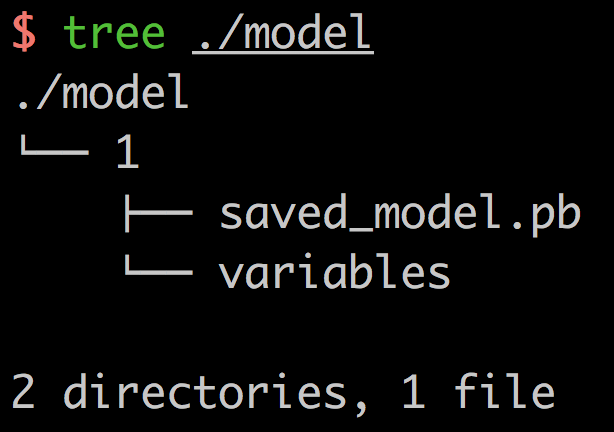
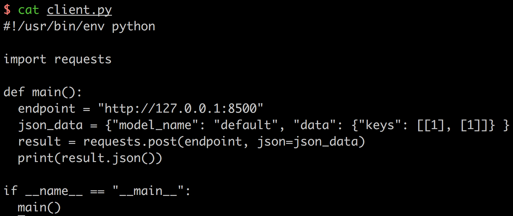

# Quick Start

Train or download the TensorFlow [SavedModel](https://www.tensorflow.org/programmers_guide/saved_model).

```python
import tensorflow as tf

export_dir = "./model/1"
input_keys_placeholder = tf.placeholder(
    tf.int32, shape=[None, 1], name="input_keys")
output_keys = tf.identity(input_keys_placeholder, name="output_keys")

session = tf.Session()
tf.saved_model.simple_save(
    session,
    export_dir,
    inputs={"keys": input_keys_placeholder},
    outputs={"keys": output_keys})
```

This script will export the model in `./model`.



Start serving to load the model.

```
simple_tensorflow_serving --model_base_path="./model"
```

Check out the dashboard in [http://127.0.0.1:8500](http://127.0.0.1:8500) in web browser.
 


Generate the clients for testing without coding.

```
curl http://localhost:8500/v1/models/default/gen_client?language=python > client.py

python ./client.py
```


